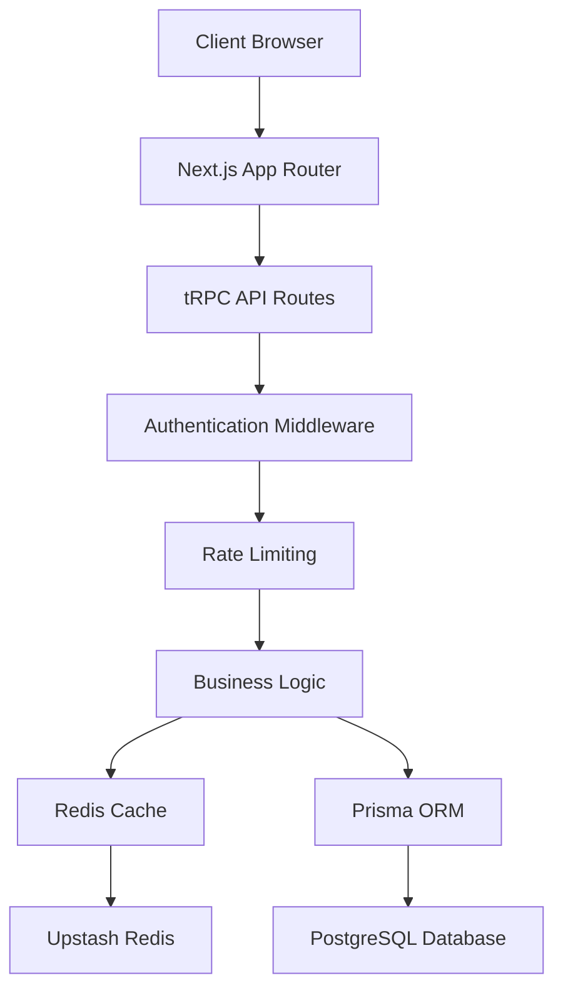
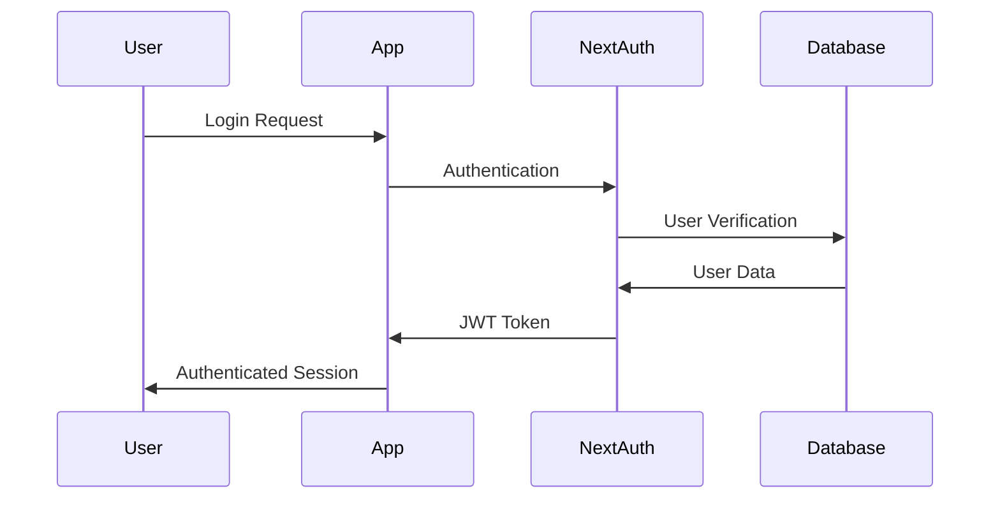

# SecureShare Architecture

## System Overview

SecureShare is a modern web application built with a layered architecture focusing on security, performance, and scalability. The system uses Next.js 15 with the App Router for both frontend and backend functionality.

## Architecture Layers

### 1. Presentation Layer (Frontend)

- **Framework**: Next.js 15 with App Router
- **UI Library**: Material-UI (MUI) v5
- **Styling**: CSS-in-JS with MUI theming
- **State Management**: React hooks + tRPC client-side caching
- **Authentication**: NextAuth.js integration

### 2. API Layer (Backend)

- **Framework**: tRPC for type-safe APIs
- **Authentication**: NextAuth.js middleware
- **Validation**: Zod schema validation
- **Error Handling**: Centralized error boundaries

### 3. Business Logic Layer

- **Secret Management**: CRUD operations with security checks
- **Access Control**: User-based permissions and sharing
- **Rate Limiting**: Multi-tier protection system
- **Caching Strategy**: Redis-based performance optimization

### 4. Data Layer

- **Primary Database**: PostgreSQL with Prisma ORM
- **Cache Layer**: Upstash Redis for performance
- **File Storage**: Local storage (extensible for cloud)

## Data Flow Architecture



## Component Architecture

### Frontend Components

```
app/
├── (auth)/              # Authentication pages
├── create/              # Secret creation flow
├── dashboard/           # User management interface
├── secret/              # Secret viewing/editing
│   ├── [id]/           # Dynamic secret routes
│   └── [id]/edit/      # Secret editing interface
└── api/                # API route handlers

components/
├── auth/               # Authentication components
├── providers/          # React context providers
├── ui/                 # Reusable UI components
└── layout/             # Layout components
```

### Backend Architecture

```
server/
├── api/
│   ├── routers/        # tRPC route definitions
│   │   ├── secret.ts   # Secret management API
│   │   ├── user.ts     # User management API
│   │   └── auth.ts     # Authentication API
│   ├── trpc.ts         # tRPC configuration
│   └── root.ts         # API router composition

lib/
├── redis.ts            # Redis client and utilities
├── rate-limiter.ts     # Rate limiting system
├── types.ts            # Shared TypeScript types
└── constants.ts        # Application constants
```

## Security Architecture

### Authentication Flow



### Authorization Model

1. **Route Protection**: Middleware-based route guards
2. **API Security**: tRPC procedure-level authorization
3. **Resource Access**: Owner-based secret access control
4. **Sharing Permissions**: Granular permission system

### Data Security

- **Encryption**: Secrets encrypted at rest (future enhancement)
- **Password Hashing**: bcrypt for password protection
- **Session Management**: Secure JWT tokens
- **CSRF Protection**: Built-in Next.js protection

## Caching Strategy

### Redis Cache Layers

1. **User Sessions**: Fast session lookup and management
2. **Secret Metadata**: Quick access to secret information
3. **Rate Limiting**: Distributed rate limit counters
4. **Analytics**: Temporary storage for metrics

### Cache Invalidation

- **Write-through**: Updates both cache and database
- **TTL-based**: Automatic expiration for temporary data
- **Manual Invalidation**: Explicit cache clearing on updates

## Database Design

### Core Entities

```sql
-- Users table
User {
  id: String (PK)
  email: String (Unique)
  name: String?
  createdAt: DateTime
  updatedAt: DateTime
}

-- Secrets table
Secret {
  id: String (PK)
  title: String?
  content: String
  password: String?
  expiresAt: DateTime?
  maxViews: Int?
  currentViews: Int
  isActive: Boolean
  createdById: String (FK)
  createdAt: DateTime
  updatedAt: DateTime
}

-- Access logging
AccessLog {
  id: String (PK)
  secretId: String (FK)
  ipAddress: String
  userAgent: String
  accessedAt: DateTime
}

-- Sharing permissions
SharedSecret {
  id: String (PK)
  secretId: String (FK)
  userId: String? (FK)
  email: String
  permissions: Enum
  createdAt: DateTime
}
```

### Relationships

- User → Secret (One-to-Many)
- Secret → AccessLog (One-to-Many)
- Secret → SharedSecret (One-to-Many)
- User → SharedSecret (One-to-Many)

## Performance Considerations

### Frontend Optimization

- **Code Splitting**: Automatic route-based splitting
- **Image Optimization**: Next.js built-in optimization
- **Bundle Analysis**: Webpack bundle analyzer integration
- **Lazy Loading**: Component and route lazy loading

### Backend Optimization

- **Database Indexing**: Strategic index placement
- **Query Optimization**: Prisma query optimization
- **Connection Pooling**: Database connection management
- **Response Caching**: Redis-based response caching

### Scalability Patterns

- **Horizontal Scaling**: Stateless application design
- **Database Scaling**: Read replicas and sharding ready
- **Cache Scaling**: Redis cluster support
- **CDN Integration**: Static asset distribution

## Monitoring and Observability

### Logging Strategy

- **Structured Logging**: JSON-based log format
- **Error Tracking**: Centralized error collection
- **Access Logging**: Detailed request tracking
- **Performance Metrics**: Response time monitoring

### Health Checks

- **Application Health**: `/api/health` endpoint
- **Database Health**: Connection and query checks
- **Redis Health**: Cache connectivity verification
- **External Dependencies**: Service availability checks

## Development Workflow

### Code Organization

- **Modular Architecture**: Feature-based organization
- **Type Safety**: End-to-end TypeScript coverage
- **Code Standards**: ESLint and Prettier configuration
- **Testing Strategy**: Unit and integration testing

### Build Pipeline

1. **Development**: Hot reloading with Turbopack
2. **Type Checking**: Continuous TypeScript validation
3. **Linting**: Code quality enforcement
4. **Testing**: Automated test execution
5. **Building**: Production optimization
6. **Deployment**: Automated deployment pipeline

## Future Enhancements

### Planned Features

- **File Upload**: Support for file-based secrets
- **End-to-End Encryption**: Client-side encryption
- **Advanced Analytics**: Detailed usage metrics
- **API Rate Limiting**: Per-user rate limits
- **Audit Trail**: Comprehensive security logging

### Scalability Improvements

- **Microservices**: Service decomposition
- **Message Queues**: Asynchronous processing
- **Edge Computing**: Global content delivery
- **Mobile Applications**: Native app development

## Deployment Architecture

### Production Environment

```
Load Balancer
    ↓
Next.js Application (Multiple Instances)
    ↓
PostgreSQL Database (Primary/Replica)
    ↓
Redis Cache (Cluster)
    ↓
External Services (OAuth, Email)
```

### Infrastructure Components

- **Application Servers**: Containerized Next.js instances
- **Database**: PostgreSQL with backup strategy
- **Cache**: Redis cluster for high availability
- **CDN**: Global static asset delivery
- **Monitoring**: Application and infrastructure monitoring

This architecture provides a solid foundation for a secure, scalable, and maintainable secret sharing application.
